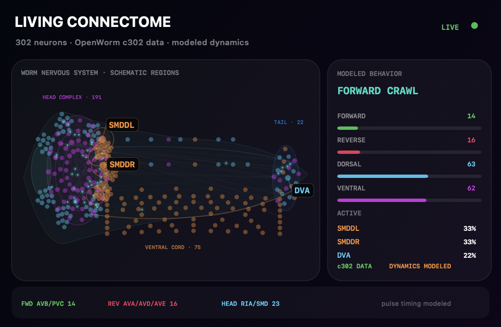

<p align="center">
  
</p>

<h1 align="center">DesktopWorm 🪱</h1>

<p align="center">
  <strong>A native macOS desktop <em>C. elegans</em> driven by the OpenWorm c302 connectome.</strong>
</p>

<p align="center">
  <a href="https://youtu.be/IuXMyePoKhs"><strong>Watch the 41-second demo</strong></a>
  ·
  <a href="https://github.com/openworm/c302">OpenWorm c302</a>
  ·
  <a href="CREDITS.md">Scientific credits</a>
</p>

DesktopWorm uses the complete 302-neuron *Caenorhabditis elegans*
hermaphrodite connectome from OpenWorm c302.

DesktopWorm crawls across the desktop, samples a deliberately slow-moving
cursor as a weak chemical attractant, reverses after fast nearby cursor
movement, and exposes a live
connectome activity window. The model includes:

- all 302 neurons;
- 5,806 neuron-to-neuron edges;
- all 95 body-wall muscles;
- 926 neuron-to-muscle edges;
- chemical synapses and electrical gap junctions;
- sensory, interneuron and motor-neuron activity visualization.

## Behavior and rendering

The desktop body is a translucent ivory/amber rendering with a tapered head
and tail, subtle pharynx and intestine, and fine cuticle rings. Its articulated
40-point centerline holds a fixed body length. An inertial body chain follows a
head-to-tail curvature wave with pulsed traction, lateral head excursion and
smooth gait transitions, so translation remains visibly coupled to bending.
Every body segment also participates in screen-boundary constraints: trailing
segments reflect inward and form a fold along an edge rather than being clipped
outside the desktop overlay.
The behavior controller favors sustained forward roaming, as observed during
off-food exploration, while retaining touch-driven
reversal, sensory pauses, exploratory head sweeps, shallow turns, deep turns,
slow approaches, dwelling, omega turns, collision recovery and pause. Cursor
chemotaxis is staged: the worm samples a target, visibly reorients its body,
then approaches the sampled position instead of being continuously dragged by
the pointer. A stationary pointer is not repeatedly interpreted as food, and
even dwelling retains slow body-wave-driven travel rather than becoming an
extended freeze.

## Living Connectome

<p align="center">
  
</p>

<p align="center">
  <sub>All 302 neuron identities and c302-derived connections are shown in a region- and class-derived nervous-system schematic; activity and packet timing are modeled.</sub>
</p>

The Living Connectome opens as a compact 520 × 340 floating HUD in the
bottom-right of the active display. It shows all 302 neurons inside a
whole-worm nervous-system schematic: sensory head-ganglia rosettes around a
layered nerve-ring neuropil, longitudinal cords, and the numbered ventral-cord
motor classes ordered along the body, plus body sensory cells and a posterior
ganglia cluster. Activity-weighted connections,
the most active cells, command-interneuron drive, dorsal and ventral muscle
activity, and the current autonomous behavior remain live. Resize it larger to
reveal the rolling history, transmitters and expanded scientific boundary.

Active chemical connections carry directional packets; electrical gap
junctions carry paired packets in both directions. The edges, weights and
connection types are c302-derived, while packet timing is explicitly modeled.
The modeled sensorimotor loop also feeds head bend back through SMD neurons and
whole-body curvature through DVA, reflecting their experimentally supported
proprioceptive roles without claiming measured voltages or calcium traces.

c302 does not provide measured per-neuron spatial coordinates in the compact
source used here. The display therefore labels this as a region- and
class-derived anatomy schematic; it does not claim that dot positions are
microscopy coordinates. Colors still identify sensory, interneuron and motor
roles, while edges and neuron identities remain c302-derived.

## Run

Requirements: macOS 13+ and Xcode Command Line Tools.

```sh
./script/build_and_run.sh
```

The Living Connectome is the app's only control window. Use the 🪱 menu-bar item
to reopen it, inject touch or food stimuli, choose the crawl speed, hide or show
internal anatomy, pause, reset or quit. The menu also links to the GitHub
repository for starring and to [@apoorvdarshan on X](https://x.com/apoorvdarshan).
Movement selection remains autonomous.
The app does not request Accessibility, keyboard, camera, microphone or network
permissions.

## Verify

```sh
./script/test.sh
./script/build_and_run.sh --build-only
./script/build_and_run.sh --verify
```

## What is real—and what is modelled

The neuron list, cell roles, neurotransmitter annotations, anatomical edge
weights, gap-junction labels, muscle list and neuromuscular edges are derived
from OpenWorm c302 data. The graded neural dynamics, uncertain synaptic signs,
cursor-to-sensory conversion, locomotor rhythm, body mechanics and rendering
are explicit modelling choices.

This is a connectome-constrained interactive visualization, not a faithful
digital organism and not a conscious or living animal.

## Credits

Created by [Apoorv Darshan](https://github.com/apoorvdarshan). The transparent
macOS connectome-organism concept was inspired by Denis Shiryaev's
[DesktopFly](https://github.com/DenisSergeevitch/desktop-fly). DesktopWorm is a
separate *C. elegans* implementation and does not bundle DesktopFly code,
assets, or FlyWire data.

Connectome data and metadata come from the
[OpenWorm c302](https://github.com/openworm/c302) project and the Cook et al.
whole-animal connectome reconstruction. Thanks to the OpenWorm contributors
and the researchers whose work made this visualization possible.

See [CREDITS.md](CREDITS.md) for full acknowledgements and scientific
citations, and [THIRD_PARTY_NOTICES.md](THIRD_PARTY_NOTICES.md) for data
provenance and licensing.
